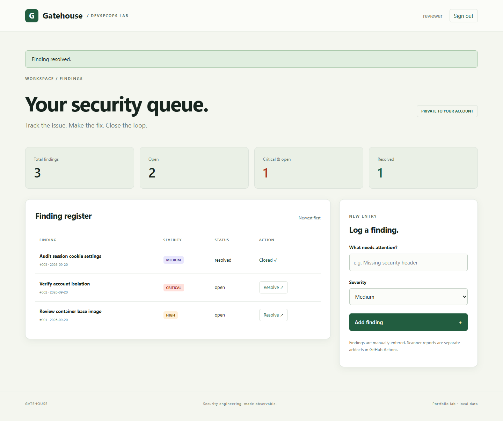
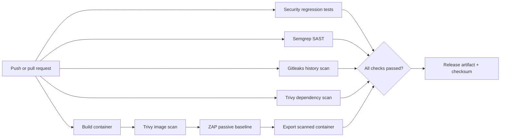

# Gatehouse

**A small security-finding tracker with an automated DevSecOps delivery pipeline.**

Gatehouse pairs a working Flask + SQLite application with GitHub Actions checks for source code, dependencies, secrets, container vulnerabilities, and HTTP responses. Its release job requires every gate to succeed before publishing a downloadable container artifact.

This is a portfolio lab. The app does not ingest scanner reports: findings in the UI are manually entered, while CI reports appear in Actions artifacts. There is no cloud deployment, production certification, invented scan badge, or historical performance claim.



The screenshot shows synthetic findings entered during browser validation, not vulnerabilities discovered by scanners.

## Quick start: Windows PowerShell

Install Python 3.12 or newer. Open a terminal **inside this folder**:

```powershell
py -3.12 -m venv .venv
.\.venv\Scripts\python.exe -m pip install -r requirements.txt
$env:SECRET_KEY = & .\.venv\Scripts\python.exe -c "import secrets; print(secrets.token_hex(48))"
.\.venv\Scripts\python.exe -m flask --app app create-user charan
.\.venv\Scripts\python.exe run.py
```

The account command prompts for a password twice; use at least 12 characters. Visit **http://127.0.0.1:8080** and sign in. No shared demo password is shipped. Keep the same terminal open to retain the generated session key.

## Quick start: macOS / Linux

```bash
python3 -m venv .venv
source .venv/bin/activate
python -m pip install -r requirements.txt
export SECRET_KEY="$(python -c 'import secrets; print(secrets.token_hex(48))')"
python -m flask --app app create-user charan
python run.py
```

Users and findings persist in `instance/gatehouse.db`, which is excluded from Git. Changing the session key signs everyone out; it does not delete data. `run.py` can generate an ephemeral local key if none is set, but account creation still requires a key in the environment.

## What to try

1. Create a finding such as “Review CSP configuration,” select a severity, and resolve it.
2. Create a second account with `python -m flask --app app create-user reviewer`; open a private browser window and verify that account cannot see the first account's findings.
3. Run `python -m unittest discover -s tests -v` to check security behavior.
4. Push this folder to GitHub and inspect the **Security pipeline** workflow and its reports.

## Delivery architecture



| Gate | Blocks on | Evidence |
| --- | --- | --- |
| Unit / integration tests | Any failing test | Actions job log |
| Semgrep | Any finding from local rules or `p/python`; configuration errors | `semgrep.json` |
| Gitleaks | Secrets detected in all checked-out Git history | Redacted `gitleaks.json` |
| Trivy dependencies | HIGH or CRITICAL known dependency vulnerabilities, including unfixed | `dependencies.json` |
| Trivy container | HIGH or CRITICAL known OS / library vulnerabilities, including unfixed | `container.json` |
| ZAP baseline | Selected missing security headers / CSRF rules, or scanner errors | `zap.html`, `zap.json` |
| Release | Any prerequisite failed, cancelled, or skipped | `candidate.tar`, `SHA256SUMS.txt` |

ZAP is **unauthenticated and passive**. It covers the login surface, not authenticated workflows or a full penetration test. Other ZAP alerts remain visible as warnings (`-I`); local HTTP may produce Secure-cookie or transport warnings. Authenticated authorization and CSRF behavior are covered by the application tests. See [the official baseline documentation](https://www.zaproxy.org/docs/docker/baseline-scan/) for the tool's scope and exit-code behavior.

The intermediate `scanned-candidate` artifact is diagnostic and can exist before other jobs pass. Only the `gatehouse-release-<commit>` artifact has passed the aggregate gate. Nothing is deployed or pushed to a registry.

## Docker

Requires Docker with Compose. Export `SECRET_KEY` as in the quick start, then:

```bash
docker compose up --build -d
docker compose exec app flask --app app create-user charan
docker compose logs app
docker compose down
```

The service binds to loopback on port 8080. A named volume preserves data after `down`. It runs as UID 10001, with a read-only root filesystem, dropped Linux capabilities, and `no-new-privileges`. The `/data` volume is writable. Do not run `down -v` unless you intend to erase the database.

## Clone and contribute

```bash
git clone https://github.com/sbalaven/gatehouse-devsecops.git
cd gatehouse-devsecops
```

Then follow either quick start above. For a change, create a branch, run the tests, and open a pull request with a short explanation and validation results.

[View the security workflow](https://github.com/sbalaven/gatehouse-devsecops/actions/workflows/security.yml) for live results and downloadable reports. No GitHub token is required inside the app or workflow. Local databases, environment files, and passwords are excluded from Git.

After the first workflow run, configure a branch ruleset requiring the **release-gate** status check for `main`. Workflow failures block the release artifact automatically; blocking merges additionally requires that repository setting. Do not add a passing badge until a run has actually passed.

Download reports from the Actions run. If a vulnerability gate fails, review the reported package and update it; do not weaken the gate just to make it green. Scanner data changes, so a formerly clean dependency or base image may fail later.

## Security design and limits

Implemented: scrypt password hashes, parameterized SQL, per-user ownership checks, session-bound CSRF tokens, escaped HTML, CSP and other response headers, 30-minute sessions, server-side logout revocation, request limits, account lockout, environment-provided secrets, and production cookie settings.

This lab has no MFA, password recovery, audit-log retention, global/IP rate limiting, distributed database, automated migration system, or production TLS ingress. Five wrong passwords lock an existing account for five minutes. That protects against repeated guesses but allows account-lockout denial of service; nonexistent accounts are not rate-limited. Production deployment needs edge throttling and a broader identity design. Logging out revokes **all** sessions for that account.

For HTTPS deployment set `APP_ENV=production`, supply a stable random `SECRET_KEY` through a secret manager, and set `TRUSTED_HOSTS` to your actual hostname(s). The local HTTP quick start intentionally omits Secure cookies; production mode enables them and HSTS. A TLS reverse proxy is not included. Read [Flask's security guidance](https://flask.palletsprojects.com/en/stable/web-security/) before adapting this lab for public hosting.

Runtime packages are version-pinned. Action major tags, scanner image tags, the ZAP `stable` image, the Python base-image tag, and registry Semgrep rules are mutable. Pin action commit SHAs / image digests and vendor reviewed rules if stronger build reproducibility is needed. Dependabot covers Python packages, Actions, and the Docker base image; scanner images embedded in shell commands need manual updates.

## Evidence and interview walkthrough

- [Validation record](docs/VALIDATION.md): exactly what has and has not been run.
- [Demo and interview guide](docs/DEMO.md): a five-minute demo, security tradeoffs, and resume wording.
- [Threat model](docs/THREAT-MODEL.md): assets, boundaries, threats, and limitations.
- [Gate failure exercise](docs/GATE-EXERCISE.md): safely demonstrate a blocked change.

Built with AI assistance. Read, run, and adapt the code before presenting it as a project you understand. The repository records implementation, not evidence of earlier employment or historical delivery dates.
